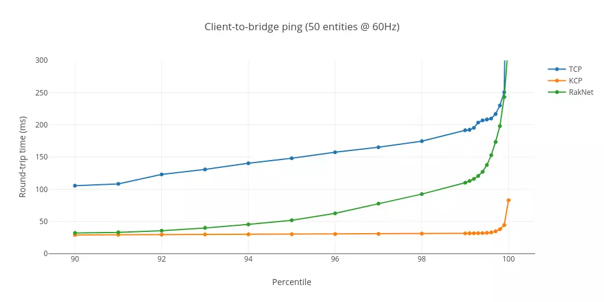

KCP - A Fast and Reliable ARQ Protocol
======================================

[![Powered][3]][1] 
[![GitHub license][6]][7]
[](#backers)
 [](#sponsors) 

[1]: https://github.com/skywind3000/kcp
[2]: https://github.com/skywind3000/kcp/raw/master/kcp.svg
[3]: https://github.com/skywind3000/kcp/raw/master/kcp.svg
[4]: https://api.travis-ci.org/skywind3000/kcp.svg?branch=master
[5]: https://travis-ci.org/skywind3000/kcp
[6]: https://img.shields.io/badge/license-MIT-blue.svg
[7]: https://github.com/skywind3000/kcp/blob/master/LICENSE

# Introduction

**KCP** is a high-performance, reliable transport protocol designed to significantly reduce latency compared to traditional TCP. It can achieve a **30–40% reduction in average latency** and up to three times lower maximum delay, _costing 10–20% additional bandwidth overhead_.

KCP is implemented purely as an algorithm; it does not handle sending or receiving packets. It is designed to be transport-agnostic. Users must define their underlying transmission logic (e.g., via UDP) and pass data to KCP through callbacks. Even timekeeping is left to the user; KCP requires the current clock value to be provided externally, making it completely free of internal system calls.

The protocol consists of two source files: **ikcp.h and ikcp.c**. These files are lightweight and easy to integrate into your existing network stack. Whether you're building a P2P system or a UDP-based protocol that needs a robust ARQ (Automatic Repeat reQuest) mechanism, you can start using KCP by adding these files to your project and writing a few lines of integration code.


# Technical Specifications

While TCP is optimized for throughput—maximizing the amount of data transmitted per second (e.g., kilobits/sec)—KCP is designed to focus on latency and packet delivery time. By prioritizing how quickly individual packets travel from sender to receiver, KCP trades 10–20% more bandwidth overhead for 30–40% faster transmission speed compared to TCP.

Think of TCP as a wide canal: it can carry a large volume of data, but the flow is relatively slow. In contrast, KCP is like a narrow, fast-moving stream—it sends smaller amounts of data more quickly, ensuring lower delay and faster responsiveness.

KCP supports both normal mode and fast mode, each optimizing performance based on different needs. Its increased flow rate is achieved through several key strategies:

#### RTO Doubled vs Not Doubled:

In TCP, retransmission timeout (RTO) increases exponentially—each failure doubles the timeout interval (RTO × 2). This means three consecutive losses can escalate to RTO × 8, leading to serious transmission delays.
KCP, in contrast, uses a more responsive approach in fast mode: the RTO increases by a factor of 1.5x (based on empirical results), significantly improving recovery speed and reducing delay after packet loss.

#### Selective Retransmission vs Full Retransmission:

TCP often retransmits all subsequent data after a lost packet, which can lead to excessive redundancy.
KCP implements selective retransmission, ensuring that only the actually lost packets are resent, minimizing unnecessary data transmission and improving efficiency.

#### Fast Retransmission:

When the sender transmits packets 1 through 5 and receives ACKs for 1, 3, 4, and 5, KCP deduces from missing ACK2 that packet 2 has likely been lost. After receiving multiple out-of-order ACKs, KCP can immediately trigger a fast retransmit of packet 2—without waiting for a timeout—drastically reducing retransmission latency under packet loss.

#### Delayed ACK vs Non-delayed ACK:

TCP often delays ACKs to optimize throughput, which can unintentionally inflate RTT calculations and delay loss detection—even with `NODELAY` settings.
KCP provides configurable ACK behavior, allowing ACKs to be sent immediately when needed, enhancing responsiveness in latency-sensitive applications.

#### UNA vs ACK+UNA：

ARQ protocols typically use either:

    UNA (Unacknowledged Acknowledgment): Confirms all packets before a given sequence number (e.g., TCP).

    ACK: Confirms receipt of a specific packet.

Each has tradeoffs: UNA can lead to full retransmissions, and standalone ACKs create overhead during loss.
KCP combines both—each control message contains UNA info, and a dedicated ACK frame is used when necessary. This hybrid model increases reliability and precision without excess cost.

#### Non-concessional Flow Control:
By default, KCP follows TCP's fair flow control—factoring in send buffer size, receiver buffer, congestion control, and slow-start.
However, for latency-critical small data, KCP can be configured to bypass congestion and slow-start, relying only on buffer sizes. This allows smooth transmission even under heavy network load (e.g., when BitTorrent is active), sacrificing some fairness for timeliness.


# Quick Install

You can download and install kcp using the [vcpkg](https://github.com/Microsoft/vcpkg) dependency manager:

    git clone https://github.com/Microsoft/vcpkg.git
    cd vcpkg
    ./bootstrap-vcpkg.sh
    ./vcpkg integrate install
    ./vcpkg install kcp

Microsoft team members and community contributors keep the kcp port in vcpkg up to date. If the version is outdated, please [create an issue or pull request](https://github.com/Microsoft/vcpkg) on the vcpkg repository.

# Basic Usage

1. Create KCP object:

   ```cpp
   // Initialize the kcp object, conv is an integer that represents the session number, 
   // same as the conv of tcp, both communication sides shall ensure the same conv, 
   // so that mutual data packets can be recognized, user is a pointer which will be 
   // passed to the callback function.
   ikcpcb *kcp = ikcp_create(conv, user);
   ```

2. Set the callback function:

   ```cpp
   // KCP lower layer protocol output function, which will be called by KCP when it 
   // needs to send data, buf/len represents the buffer and data length. 
   // user refers to the incoming value at the time the kcp object is created to 
   // distinguish between multiple KCP objects
   int udp_output(const char *buf, int len, ikcpcb *kcp, void *user)
   {
     ....
   }
   // Set the callback function
   kcp->output = udp_output;
   ```

3. Call update in an interval:

   ```cpp
   // Call ikcp_update at a certain frequency to update the kcp state, and pass in 
   // the current clock (in milliseconds). If the call is executed every 10ms, or 
   // ikcp_check is used to determine time of the next call for update, no need to 
   // call every time;
   ikcp_update(kcp, millisec);
   ```

4. Input a lower layer data packet:

   ```cpp
   // Need to call when a lower layer data packet (such as UDP packet)is received:
   ikcp_input(kcp, received_udp_packet, received_udp_size);
   ```

   After processing the output/input of the lower layer protocols, the KCP protocol can work normally. ikcp_send is used to send data to the remote end, while the other end uses ikcp_recv (kcp, ptr, size) to receive the data.


# Protocol Configuration

The protocol default mode is a standard ARQ, and various acceleration switches can be enabled by configuration:

1. Working Mode:
   ```cpp
   int ikcp_nodelay(ikcpcb *kcp, int nodelay, int interval, int resend, int nc)
   ```

   - `nodelay`: Whether nodelay mode is enabled, 0 is not enabled; 1 enabled.
   - `interval` ：P rotocol internal work interval, in milliseconds, such as 10 ms or 20 ms.
   - `resend`  ：Fast retransmission mode, 0 represents off by default, 2 can be set (2 ACK spans will result in direct retransmission)
   - `nc` ： Whether to turn off flow control, 0 represents “Do not turn off” by default, 1 represents “Turn off”.
   - Normal Mode: ikcp_nodelay(kcp, 0, 40, 0, 0);
   - Turbo Mode： ikcp_nodelay(kcp, 1, 10, 2, 1);

2. Window Size:
   ```cpp
   int ikcp_wndsize(ikcpcb *kcp, int sndwnd, int rcvwnd);
   ```
   By default, the call will set the maximum send window and maximum receive window size of the procotol, 32. This can be understood as SND_BUF and RCV_BUF of TCP, but the unit is not the same, SND / RCV_BUF unit is byte, while this unit is the packet.

3. Maximum Transmission Unit:

   The algorithm protocol is not responsible for MTU detection. The default MTU is 1400 bytes, which can be set using ikcp_setmtu. The value will affect the maximum transmission unit upon data packet merging and fragmentation.

4. Minimum RTO:

   No matter TCP or KCP, they have the limitation for the minimum RTO when calculating the RTO, even if the calculated RTO is 40ms, as the default RTO is 100ms, the protocol can only detect packet loss after 100ms, which is 30ms in the fast mode, and the value can be manually changed: 
   ```cpp
   kcp->rx_minrto = 10;
   ```


# Document Indexing

Both the use and configuration of the protocol is straightforward, in most cases, after you read the above contents, you can use it. If you need further fine control, such as changing the KCP memory allocator, or if you need more efficient large-scale scheduling of KCP links (such as more than 3,500 links), or to better combine with TCP, you can continue the extensive reading:

- [KCP Best Practice](https://github.com/skywind3000/kcp/wiki/KCP-Best-Practice-EN)
- [Integration with the Existing TCP Server](https://github.com/skywind3000/kcp/wiki/KCP-Best-Practice-EN)
- [Benchmarks](https://github.com/skywind3000/kcp/wiki/KCP-Benchmark)


# Related Applications

- [kcptun](https://github.com/xtaci/kcptun): High-speed remote port forwarding based (tunnel) on kcp-go, with ssh-D, it allows smoother online video viewing than finalspeed.
- [dog-tunnel](https://github.com/vzex/dog-tunnel): Network tunnel developed by GO, using KCP to greatly improve the transmission speed, and migrated a GO version of the KCP.
- [v2ray](https://www.v2ray.com)：Well-known proxy software, Shadowsocks replacement, integrated with kcp protocol after 1.17, using UDP transmission, no data packet features.
- [HP-Socket](https://github.com/ldcsaa/HP-Socket): High Performance TCP/UDP/HTTP Communication Component.
- [frp](https://github.com/fatedier/frp): A fast reverse proxy to help you expose a local server behind a NAT or firewall to the internet. 
- [asio-kcp](https://github.com/libinzhangyuan/asio_kcp): Use the complete UDP network library of KCP, complete implementation of UDP-based link state management, session control and KCP protocol scheduling, etc.
- [kcp-cpp](https://github.com/Unit-X/kcp-cpp): Multi-platform (Windows, MacOS, Linux) C++ implementation of KCP as a simple library in your application. Contains socket handling and helper functions for all platforms.
- [kcp-perl](https://github.com/Homqyy/kcp-perl): Perl extensions for kcp. It's OOP and Perl-Like.
- [kcp-java](https://github.com/hkspirt/kcp-java)：Implementation of Java version of KCP protocol.
- [kcp-netty](https://github.com/szhnet/kcp-netty)：Java implementation of KCP based on Netty.
- [java-kcp](https://github.com/l42111996/java-Kcp): JAVA version KCP, based on netty implementation (including fec function)
- [csharp-kcp](https://github.com/l42111996/csharp-kcp): csharp version KCP, based on dotNetty implementation (including fec function)
- [kcp-go](https://github.com/xtaci/kcp-go): High-security GO language implementation of kcp, including simple implementation of UDP session management, as a base library for subsequent development.
- [kcp-csharp](https://github.com/limpo1989/kcp-csharp): The csharp migration of kcp, containing the session management, which can access the above kcp-go server.
- [KcpTransport](https://github.com/Cysharp/KcpTransport): KcpTransport is built on top of KCP ported to Pure C#, with implementations of Syn Cookie handshake, connection management, Unreliable communication, and KeepAlive. In the future, encryption will also be supported.
- [Kcp-CSharp](https://github.com/Molth/Kcp-CSharp): a pure C# KCP instance callback(delegate) wrapper for (Unity/Godot/.NET)
- [kcp2k](https://github.com/vis2k/kcp2k/): Line-by-line translation to C#, with optional Server/Client on top.
- [kcp-rs](https://github.com/en/kcp-rs): The rust migration of KCP
- [kcp-rust-native](https://github.com/b23r0/kcp-rust-native)：KCP bindings for Rust
- [lua-kcp](https://github.com/linxiaolong/lua-kcp): Lua extension of KCP, applicable for Lua server
- [node-kcp](https://github.com/leenjewel/node-kcp): KCP interface for node-js 
- [nysocks](https://github.com/oyyd/nysocks): Nysocks provides proxy services base on libuv and kcp for nodejs users. Both SOCKS5 and ss protocols are supported in the client.
- [shadowsocks-android](https://github.com/shadowsocks/shadowsocks-android): Shadowsocks for android has integrated kcptun using kcp protocol to accelerate shadowsocks, with good results
- [kcpuv](https://github.com/elisaday/kcpuv): The kcpuv library developed with libuv, currently still in the early alpha phase.
- [xkcptun](https://github.com/liudf0716/xkcptun): C language implementation of kcptun, embedded-friendly for [LEDE](https://github.com/lede-project/source) and [OpenWrt](https://github.com/openwrt/openwrt) projects.
- [yasio](https://github.com/yasio/yasio): A cross-platform asynchronous socket library focus on any client application with kcp support, easy to use, API same with UDP and TCP, see [benchmark-pump](https://github.com/yasio/yasio/blob/master/benchmark.md).
- [gouxp](https://github.com/shaoyuan1943/gouxp): Implementing a callback-based KCP development package with Go, with decryption and FEC support, is easy to use.
- [kcp.py](https://github.com/RealistikDash/kcp.py): Python bindings and networking with an emphasis on dev friendliness.
- [pykcp](https://github.com/enkiller/pykcp): KCP implementation for Python version.
- [php-ext-kcp](https://github.com/wpjscc/php-ext-kcp): php extension for KCP.
- [asio-kcp(new)](https://github.com/sniper00/asio-kcp): KCP implementation for C++/Asio, with Modern C++/Asio async features, such as coroutine.

# Protocol Comparison

If the network is never congested, KCP/TCP performance is similar; but the network itself is not reliable, and packet loss and jitter may be inevitable (otherwise why there are various reliable protocols). Compared in the intranet environment which is almost ideal, they have similar performance, but on the public Internet, under 3G / 4G network situation, or using the intranet packet loss simulation, the gap is obvious. The public network has an average of nearly 10% packet loss during peak times, which is even worse in wifi / 3g / 4g network, all of which will cause transmission congestion.

Thanks to [zhangyuan](https://github.com/libinzhangyuan) the author of [asio-kcp](https://github.com/libinzhangyuan/asio_kcp) for the horizontal evaluation on KCP, enet and udt, and the conclusions are as follows:

- ASIO-KCP **has good performace in wifi and phone network(3G, 4G)**.
- The kcp is the **first choice for realtime pvp game**.
- The lag is less than 1 second when network lag happen. **3 times better than enet** when lag happen.
- The enet is a good choice if your game allow 2 second lag.
- **UDT is a bad idea**. It always sink into badly situation of more than serval seconds lag. And the recovery is not expected.
- enet has the problem of lack of doc. And it has lots of functions that you may intrest.
- kcp's doc is in both chinese and english. Good thing is the function detail which is writen in code is english. And you can use asio_kcp which is a good wrap.
- The kcp is a simple thing. You will write more code if you want more feature.
- UDT has a perfect doc. UDT may has more bug than others as I feeling.

For specifics please refer to: [Reliable Udp Benchmark](https://github.com/libinzhangyuan/reliable_udp_bench_mark) and [KCP-Benchmark](https://github.com/skywind3000/kcp/wiki/KCP-Benchmark), for more guidance to the hesitant users.

MMO Engine [SpatialOS](https://improbable.io/spatialOS) has a benchmark report on KCP/TCP/RakNet:



for more details, please see the report itself:

- [Kcp a new low latency secure network stack](https://improbable.io/blog/kcp-a-new-low-latency-secure-network-stack)

# KCP is used by

See [Success Stories](https://github.com/skywind3000/kcp/wiki/Success-Stories).

# Donation


Donation is welcome by using alipay, the money will be used to improve the protocol and documentation.


twitter: https://twitter.com/skywind3000
blog: http://www.skywind.me

zhihu: https://www.zhihu.com/people/skywind3000
